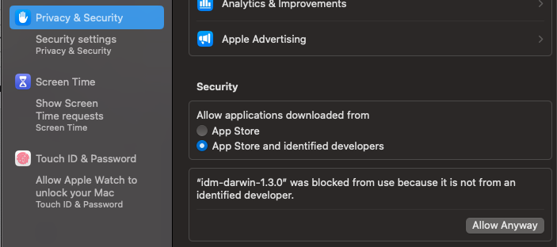

# ID Magalu CLI
CLI para operações relacionadas aos recursos do ID Magalu.
## Instalação do CLI
- Realizar download do arquivo de acordo com o sistema operacional na página [Releases](https://github.com/luizalabs/id-magalu-cli/releases);
- Renomear arquivo para `idm`;
### Linux
- Tornar o arquivo executável -> `chmod +x idm`
- (opcional) Tornar o arquivo executável de qualquer lugar movendo para a pasta bin -> `sudo mv idm /usr/bin`
### Windows
- (opcional) Tornar o arquivo executável de qualquer lugar movendo para a pasta `C:\Windows\System32`.
### MacOS
- Tornar o arquivo executável -> `chmod +x idm`
- (opcional) Tornar o arquivo executável de qualquer lugar movendo para a pasta `mv idm /usr/local/bin`.
- Permitir a execução do app não baixado pela App Store:
- 
## Utilização
### Help
```
idm <command> -h
Ex:
idm -h
idm login -h
idm client -h
```
### Login
Para utilizar as features disponíveis é necessário primeiramente realizar o login através do comando:
```
idm login
```
### Scopes
#### Listando Scopes
O comando a seguir retorna todos os scopes disponíveis para utilizar na criação de clients:
```
idm scope list
-- Ordenando por API Product
idm scope list -o api-product
ou
idm scope list --order-by api-product
```
### Clients
#### Criando Clients
O comando a seguir cria um novo client:
```
idm client create --name 'client-name' --description 'Client Description' --terms-of-use 'http://terms.com.br' --privacy-term 'http://term.com.br' --icon 'http://icon.com/icon.png' --redirect-uris 'https://redirect1.com https://redirect2.com' --scopes 'scope-x scope-y' --reason 'Scopes needed by UI to...' --audience 'public' --access-token-exp 300 --always-require-login true'
```
Detalhes dos atributos para criação de um client
```
  -n, --name string                                   # Nome
  -d, --description string                            # Descrição
  -t, --terms-of-use string                           # Link para termos de uso
  -p, --privacy-term string                           # Link para o termo de privacidade
  -i, --icon string                                   # Link para uma imagem
  -u, --redirect-uris string                          # Redirecionar URIs (separados por espaço)
  -s, --scopes string                                 # Nomes de escopos (separados por espaço)
  -r, --reason string                                 # Razão pela qual você está adicionando um escopo. Usado somente quando pelo menos um dos escopos necessita de aprovação para ser utilizado
  -a, --audience string                               # Declaração de token de acesso Aud (separada por espaço)
  -x, --access-token-exp uint32                       # Tempo de expiração do token de acesso (em segundos)
  -q, --always-require-login string                   # Ignorar a sessão ativa do Magalu ID e sempre exigir login (true|false)
  -f, --refresh-token-custom-expires-enabled string   # Personalizar tempo de expiração do token de atualização (true|false)
  -e, --refresh-token-exp uint32                      # Tempo de expiração do token de atualização (em segundos)
  -l, --backchannel-logout-session-required string    # O cliente requer sessão de logout do backchannel (true|false)
  -b, --backchannel-logout-uri string                 # URI de logout do backchannel
  -m, --scopes-default string                         # Nome dos escopos padrão (separados por espaço)  
```
Para conferir a lista completa de atributos para criação de clients utilize o comando abaixo:
```
idm client create -h
```
#### Adicionando scopes ao clients
O comando a seguir adiciona scopes ao client:
```
idm client add-scope --client-uuid 'XXXXXX-XXXf-4XX2-8XXa9-37cXXXXXXd09' --scopes 'scope-x scope-y' --reason 'My client needs this scope because...'
```
Detalhes sobre os atributos de scopes para adição no client
```
-i, --client-uuid   # UUID do client ao qual o scope será adicionado.
-s, --scopes        # Lista de nome de scopes separados por espaço.
-r, --reason        # Se algum dos scopes requerer aprovação de uso, esse texto irá aparecer para o dono do scope para que possa realizar a aprovação de uso.
```
#### Listando clients
O comando a seguir retorna a lista de clients que o usuário possui:
```
idm client list
```
#### Alterando clients
O seguinte comando altera as propriedades de um client:
```
idm client update --id xxx-xxx-x-xxx-xxxx --description "Description Updated" --redirect-uris "https://service.com"
```
Detalhes sobre os atributos de alteração de um client
```
  -n, --name string                                   # Nome
  -d, --description string                            # Descrição
  -t, --terms-of-use string                           # Link para termos de uso
  -p, --privacy-term string                           # Link para o termo de privacidade
  -i, --icon string                                   # Link para uma imagem
  -u, --redirect-uris string                          # Redirecionar URIs (separados por espaço)
  -s, --scopes string                                 # Nomes de escopos (separados por espaço)
  -r, --reason string                                 # Razão pela qual você está adicionando um escopo. Usado somente quando pelo menos um dos escopos necessita de aprovação para ser utilizado
  -a, --audience string                               # Declaração de token de acesso Aud (separada por espaço)  
  -x, --access-token-exp uint32                       # Tempo de expiração do token de acesso (em segundos)
  -q, --always-require-login string                   # Ignorar a sessão ativa do Magalu ID e sempre exigir login (true|false)
  -f, --refresh-token-custom-expires-enabled string   # Personalizar tempo de expiração do token de atualização (true|false)
  -e, --refresh-token-exp uint32                      # Tempo de expiração do token de atualização (em segundos)
  -l, --backchannel-logout-session-required string    # O cliente requer sessão de logout do backchannel (true|false)
  -b, --backchannel-logout-uri string                 # URI de logout do backchannel  
  -m, --scopes-default string                         # Nome dos escopos padrão (separados por espaço)
  
```
Para conferir a lista completa de atributos do processo de alteração de clients utilize o comando abaixo:
```
idm client update -h
```